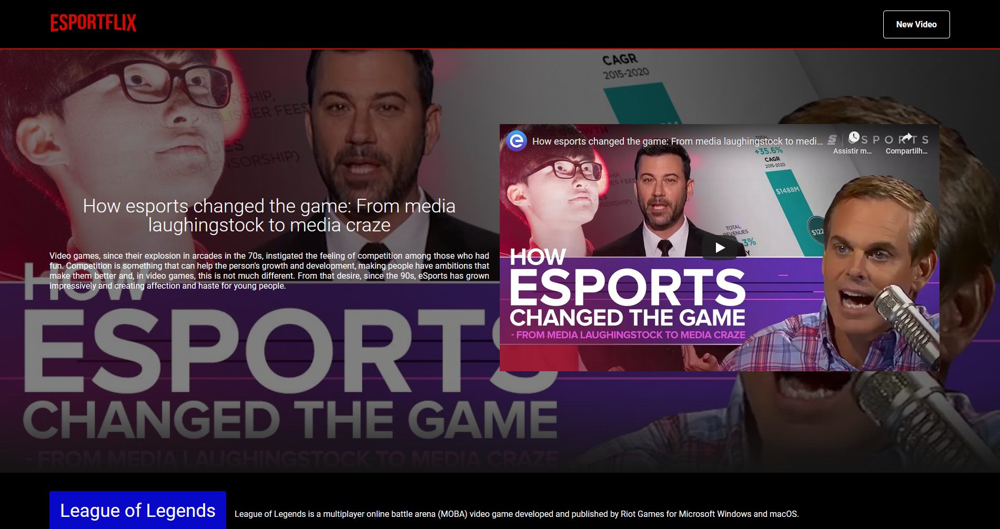

   

  <a href="#movie_camera-preview">Preview</a>&nbsp;&nbsp;&nbsp;|&nbsp;&nbsp;&nbsp;
  <a href="#file_folder-demo-website">Demo Website</a>&nbsp;&nbsp;&nbsp;|&nbsp;&nbsp;&nbsp;
  <a href="#books-technologies">Technologies</a>&nbsp;&nbsp;&nbsp;|&nbsp;&nbsp;&nbsp;
  <a href="#computer-project">Project</a>&nbsp;&nbsp;&nbsp;|&nbsp;&nbsp;&nbsp;
  <a href="#green_book-how-to-run">How to Run</a>

	
   
  

  

## :movie_camera: Preview

## :file_folder: Demo Website
You can acess the website at:     
👉  Demo: https://esportflix.vercel.app/

## :books: Technologies

This project was made using the follow technologies:

- [Node.js](https://nodejs.org/en/)
- [React](https://reactjs.org)

## :computer: Project
 💻🎮 Esportflix is an eSportes video site project made with React.js and Node.js, created at Imersão React Alura. The project aims to be a catalog of the main matches and moments of the eSports. 🎮💻 
 
## :green_book: How to run

### Clone Repository
$ git clone https://github.com/antoniovictormt/Esportsflix.git

### Run Web Project

* Install Dependencies
 $ yarn install

* Run Aplication
 $ yarn start

Go to http://localhost:3000/ to see the result.
